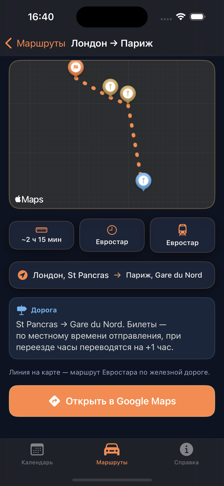
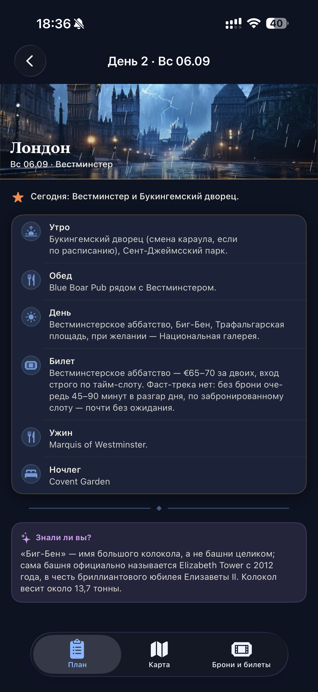
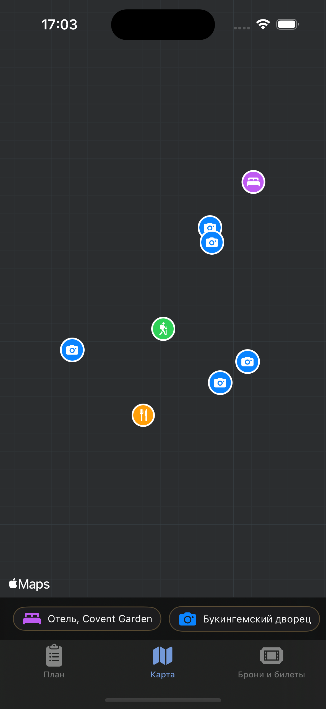

# TripGuide — London → Lyon 🗺️

A SwiftUI travel guide app: 22 days along the route London → Paris → Beaune → Annecy → Chamonix → Les Arcs 1950 → Turin → Lyon, September 2026.

## Screenshots

| | | |
|---|---|---|
|  |  |  |
| Main screen — 22 days | Routes tab | Transfer detail map |
|  |  |  |
| Day plan with stops | Day map with POIs | Bookings & tickets |

## Features

- **22-day calendar** — tap any day to open its plan, map, and bookings
- **In-day map** — routes between stops along real roads (offline, geometry bundled in the app)
- **87 offline routes** — walking, driving, and Eurostar through the Channel Tunnel
- **Routes tab** — all transfers with a map and an "Open in Google Maps" button (directions from your current location)
- **Info tab** — documents, money, weather, budget, and backup plans
- **Bookings & tickets** — all hotels, transport, and attractions with dates
- **Swipe between days** — left/right without going back to the calendar
- **Easter eggs** — triple-tap on a day's plan screen triggers a unique animation for each of the 22 days
- **User location on maps** — live blue dot and a "locate me" button on the day and transfer maps; navigation opens directions from your current location
- **iPad support** — comfortable column width, larger map
- **Apple Watch app** — two screens (walking / driving routes) with turn-by-turn navigation **from your current location**: live location, voice + haptic maneuver prompts, and a full-screen map (live route from your position, auto-hiding controls). Runs standalone and installs from the paired iPhone.

## Tech Stack

| | |
|---|---|
| UI | SwiftUI (iOS 17+) |
| Maps | MapKit, `MKDirections` |
| Watch | watchOS companion — MapKit, `MKDirections`, `AVSpeechSynthesizer`, haptics |
| Location | CoreLocation — live user location, background updates on the watch |
| Offline routes | OSRM (roads), Transitous / GTFS (Eurostar) |
| Geometry | Google Encoded Polyline (87 routes in `BundledRoutes.swift`) |
| Tests | Swift Testing framework (17 tests) |
| Language | Swift 5 language mode (Xcode 26 toolchain) |

## Project Structure

```
TripGuide/
├── TripGuideApp.swift       # App entry point
├── RootView.swift           # Bottom tab bar
├── Theme.swift              # Colors, fonts, and helper modifiers
├── Models.swift             # Day and POI data models
├── TripData.swift           # All 22 days: stops, descriptions, coordinates
├── CalendarView.swift       # Main calendar screen
├── DayDetailView.swift      # Day screen (plan / map / bookings)
├── DayPlanView.swift        # Day stop list with easter egg
├── MapTabView.swift         # Day map with route polyline
├── MapGeometry.swift        # Shared helper: camera fit, region
├── RouteModels.swift        # Transfer and waypoint models
├── RouteData.swift          # All 7 transfers with waypoints
├── RoutesView.swift         # Transfer list
├── RouteDetailView.swift    # Transfer detail map
├── TransitRouting.swift     # Transitous API client
├── BundledRoutes.swift      # 87 offline routes (auto-generated)
├── BookingModels.swift      # Booking data models
├── BookingData.swift        # Bookings and ticket data
├── BookingsTabView.swift    # Bookings screen
├── InfoView.swift           # Reference section
├── NightCityScene.swift     # Animated night city background per city
├── EasterEggScene.swift     # Per-day easter eggs
├── Haptics.swift            # Haptic feedback
├── LocationProvider.swift   # User location for the maps ("locate me")
└── Assets.xcassets/         # App icon, colors, city photos

TripGuide Watch App/         # watchOS companion (navigation)
├── TripGuideWatchApp.swift  # Watch app entry
├── WatchRootView.swift      # Two tabs: walking / driving routes
├── WatchDayListView.swift   # Days that have walking segments
├── WatchWalkListView.swift  # Walking segments of a day
├── WatchCarListView.swift   # The 7 transfers (driving / Eurostar)
├── WatchNavigationView.swift# Route screen: map preview, banner prompts, start/stop
├── WatchFullMapView.swift   # Full-screen map with "locate me" / "fit route"
├── WatchNavigator.swift     # Location + MKDirections turn-by-turn engine
├── WatchWalkData.swift      # Walking segments from shared TripData/BundledRoutes
├── WatchCarData.swift       # The 7 transfers (shared geometry)
├── WatchNavLeg.swift        # Unified leg model for the nav screen
├── WatchPolyline.swift      # Google polyline decoder
└── WatchFormat.swift        # Distance formatting
```

`Models.swift`, `TripData.swift` and `BundledRoutes.swift` are shared between the iOS app and the watch app (single source of truth — no divergence).

## Offline Routes

All 87 routes are pre-fetched and bundled in `BundledRoutes.swift` — the app renders real road geometry with no network required. To refresh routes:

```bash
cd scripts
python3 fetch_routes.py
```

The script queries OSRM (driving and walking routes) and Transitous (Eurostar rail geometry) and overwrites `BundledRoutes.swift`.

## Tests

```bash
# In Xcode: Product → Test (⌘U)
```

17 tests covering data integrity for all 22 days, offline geometry presence for all 87 routes, and coordinate accuracy.
